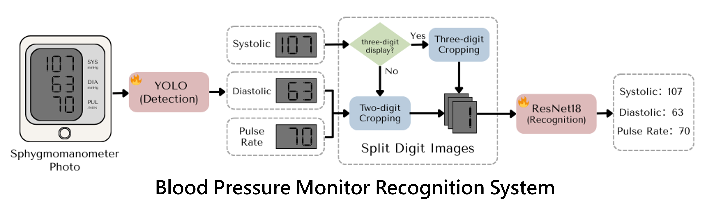

**Read this in other languages: [繁體中文](files/README_zh_TW.md)**

# Blood Pressure Monitor Recognition System

A deep learning-based digital recognition system for blood pressure monitors that automatically extracts systolic pressure (SYS), diastolic pressure (DIA), and pulse rate (PUL) readings from blood pressure monitor screen photos, with health trend analysis capabilities.

---

## 📸 Overview



---

## 🌟 Key Features

- **Digital Recognition**: Uses YOLO v11 for blood pressure monitor region localization and ResNet-18 for seven-segment display digit classification
- **Multi-Reading Extraction**: Simultaneously identifies systolic pressure, diastolic pressure, and pulse rate values
- **Health Trend Tracking**: Automatically records measurement data and generates trend charts
- **User-Friendly Interface**: Web interface based on Gradio with drag-and-drop upload support
- **High-Precision Recognition**: Improves recognition accuracy through image preprocessing and automatic segmentation

## 🔧 System Architecture

```
BP_Monitor_Recognition_System/
├── checkpoints/                    # Model weight files
│   ├── localization_best.pt       # YOLO localization model
│   └── seven_seg_classification_best.pth  # ResNet classification model
├── dataset/                        # Training datasets
│   ├── localization/              # YOLO training data
│   └── seven_seg_classify/        # Digit classification data
├── train/                         # Training scripts
│   ├── train_localization.py      # YOLO model training
│   └── train_seven_seg_classification.py  # ResNet model training
├── utils/                         # Utility functions
│   ├── inference_localization.py  # Region localization inference
│   ├── inference_seven_seg_classification.py  # Digit classification inference
│   ├── cut_digits.py             # Digit segmentation tool
│   └── image_preprocess.py       # Image preprocessing
├── my_images/                     # Test images folder
├── bp_app.py                      # Gradio Web application
├── inference.py                   # Command-line inference script
└── requirements.txt               # Dependencies list
```

## 🚀 Quick Start

### System Requirements

- Python 3.12.3
- CUDA-supported GPU (recommended, CPU also works but slower)

### Installation

1. **Clone the Repository**
   ```bash
   git clone https://github.com/Vincent-Lien/BP_Monitor_Recognition_System.git
   cd BP_Monitor_Recognition_System
   ```

2. **Create Virtual Environment** (conda recommended)
   ```bash
   conda create -n bp_monitor python=3.12.3
   conda activate bp_monitor
   ```

3. **Install Dependencies**
   ```bash
   pip install -r requirements.txt
   ```

4. **Download Pre-trained Models**
   - Download model weights from [Google Drive](https://drive.google.com/file/d/1RicowZ_WhDdbD7_6BlmGC8gKyjMzJqwF/view?usp=sharing)
   - Extract and place in the `checkpoints/` folder

   ```bash
   mkdir checkpoints
   # Place downloaded model files in checkpoints folder
   # Ensure correct filenames:
   # - localization_best.pt
   # - seven_seg_classification_best.pth
   ```

### Usage

#### 1. Web Interface (Recommended)

Launch the Gradio web application:

```bash
python bp_app.py
```

- Open the displayed local URL in your browser (usually `http://127.0.0.1:7860`)
- Upload blood pressure monitor screen photos
- The system will automatically recognize readings and update trend charts

#### 2. Command Line Interface

Batch process test images:

```bash
# Place test images in my_images/ folder
python inference.py
```

## 🏋️ Training Models from Scratch

If you want to train the models yourself, follow these steps:

### Dataset Preparation

1. **Localization Model Dataset**
   - Download: [Sphygmomanometer Dataset](https://universe.roboflow.com/sphygmomanometer/sphygmomanometer-qcpzd/dataset/10)
   - Extract to `dataset/localization/`

2. **Digit Classification Dataset**
   - Download: [Seven Segment Numbers](https://www.kaggle.com/datasets/testtor/sevensegment-numbers)
   - Extract to `dataset/seven_seg_classify/`

### Training Process

1. **Train Region Localization Model**
   ```bash
   python train/train_localization.py
   ```

2. **Move Trained Weights**
   ```bash
   mkdir -p checkpoints
   mv runs/detect/train/weights/best.pt checkpoints/localization_best.pt
   ```

3. **Train Digit Classification Model**
   ```bash
   python train/train_seven_seg_classification.py --data_dir dataset/seven_seg_classify/
   ```

---

*This project is a final project for the Pattern Recognition course in 2024 spring semester at National Yang Ming Chiao Tung University.*