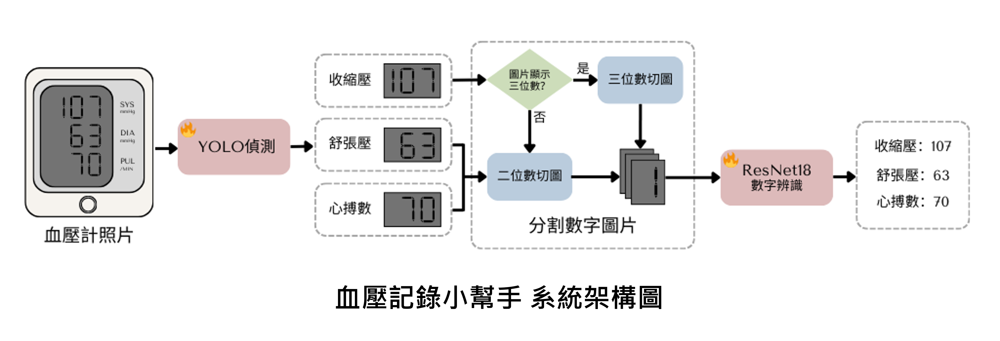

**其他語言版本: [English](../README.md)**

# 血壓記錄小幫手 (BP Monitor Recognition System)

一個基於深度學習的血壓計數字識別系統，能夠自動從血壓計螢幕照片中提取收縮壓(SYS)、舒張壓(DIA)和心率(PUL)讀數，並提供健康趨勢分析。

---

## 📸 系統架構圖



---

## 🌟 主要功能

- **數字識別**: 使用 YOLO v11 進行血壓計數值區域定位，ResNet-18 進行七段顯示器數字分類
- **多讀數提取**: 同時識別收縮壓、舒張壓和心率數值
- **健康趨勢追蹤**: 自動記錄測量數據並生成趨勢圖表
- **用戶友好界面**: 基於 Gradio 的 Web 界面，支持拖拽上傳
- **高精度識別**: 通過圖像預處理和自動分割提高識別準確率

## 🔧 系統架構

```
BP_Monitor_Recognition_System/
├── checkpoints/                    # 模型權重文件
│   ├── localization_best.pt       # YOLO 定位模型
│   └── seven_seg_classification_best.pth  # ResNet 分類模型
├── dataset/                        # 訓練資料集
│   ├── localization/              # YOLO 訓練數據
│   └── seven_seg_classify/        # 數字分類數據
├── train/                         # 訓練腳本
│   ├── train_localization.py      # YOLO 模型訓練
│   └── train_seven_seg_classification.py  # ResNet 模型訓練
├── utils/                         # 工具函數
│   ├── inference_localization.py  # 數值區域定位推理
│   ├── inference_seven_seg_classification.py  # 數字分類推理
│   ├── cut_digits.py             # 數字分割工具
│   └── image_preprocess.py       # 圖像預處理
├── my_images/                     # 測試圖片資料夾
├── bp_app.py                      # Gradio Web 應用
├── inference.py                   # 命令行推理腳本
└── requirements.txt               # 依賴套件清單
```

## 🚀 快速開始

### 環境需求

- Python 3.12.3
- CUDA 支持的 GPU  

### 安裝步驟

1. **下載專案**
   ```bash
   git clone https://github.com/Vincent-Lien/BP_Monitor_Recognition_System.git
   cd BP_Monitor_Recognition_System
   ```

2. **建立虛擬環境** (推薦使用 conda)
   ```bash
   conda create -n bp_monitor python=3.12.3
   conda activate bp_monitor
   ```

3. **安裝依賴套件**
   ```bash
   pip install -r requirements.txt
   ```

4. **下載預訓練模型**
   - 從 [Google Drive](https://drive.google.com/file/d/1RicowZ_WhDdbD7_6BlmGC8gKyjMzJqwF/view?usp=sharing) 下載模型權重
   - 解壓縮並放置於 `checkpoints/` 資料夾中

   ```bash
   mkdir checkpoints
   # 將下載的模型文件放入 checkpoints 資料夾
   # 確保文件名稱正確：
   # - localization_best.pt
   # - seven_seg_classification_best.pth
   ```

### 使用方式

#### 1. Web 界面 (推薦)

啟動 Gradio 網頁應用：

```bash
python bp_app.py
```

- 在瀏覽器中打開顯示的本地網址 (通常是 `http://127.0.0.1:7860`)
- 上傳血壓計螢幕照片
- 系統將自動識別讀數並更新趨勢圖表

#### 2. 命令行界面

批量處理測試圖片：

```bash
# 將測試圖片放入 my_images/ 資料夾
python inference.py
```

## 🏋️ 從頭訓練模型

如果你想要自己訓練模型，請按照以下步驟：

### 準備資料集

1. **定位模型資料集**
   - 下載：[Sphygmomanometer Dataset](https://universe.roboflow.com/sphygmomanometer/sphygmomanometer-qcpzd/dataset/10)
   - 解壓至 `dataset/localization/`

2. **數字分類資料集**
   - 下載：[Seven Segment Numbers](https://www.kaggle.com/datasets/testtor/sevensegment-numbers)
   - 解壓至 `dataset/seven_seg_classify/`

### 訓練流程

1. **訓練數值區域定位模型**
   ```bash
   python train/train_localization.py
   ```

2. **移動訓練好的權重**
   ```bash
   mkdir -p checkpoints
   mv runs/detect/train/weights/best.pt checkpoints/localization_best.pt
   ```

3. **訓練數字分類模型**
   ```bash
   python train/train_seven_seg_classification.py --data_dir dataset/seven_seg_classify/
   ```

---

*本專案為 國立陽明交通大學 113學年度下學期 圖形識別課程 期末專題作品。*